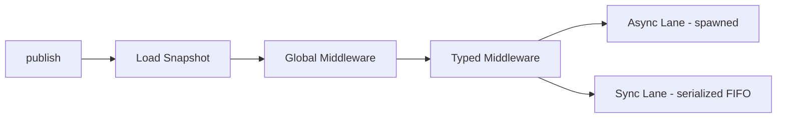

# ⚡ JAEB — Just Another Event Bus

[](https://crates.io/crates/jaeb)
[](https://docs.rs/jaeb)
[](https://github.com/LinkeTh/jaeb/actions/workflows/ci.yml)
[](https://github.com/LinkeTh/jaeb)
[](https://github.com/LinkeTh/jaeb/blob/main/LICENSE)
[](https://crates.io/crates/jaeb)

> A lightweight, in-process event bus for Tokio — snapshot-driven dispatch with retry, dead-letter, and middleware support.

### ✨ Highlights

- 🔀 **Sync + Async** handlers behind one `subscribe` API
- 🔁 **Retry & Dead Letters** with per-listener policies
- 🧩 **Typed & Global Middleware** pipeline
- 📊 **Optional Metrics** (Prometheus-compatible via `metrics` crate)
- 🔍 **Built-in Tracing** support (`trace` feature)
- 🛑 **Graceful Shutdown** with async drain + timeout
- 🏗️ **summer-rs Integration** for plugin-based auto-registration

## When to use JAEB

Use JAEB when you need:

- domain events inside one process (e.g. `OrderCreated` -> projections, notifications, audit)
- decoupled modules with type-safe fan-out
- retry/dead-letter behavior per listener
- deterministic sync-lane ordering with priority hints

JAEB is **not** a message broker — it does not provide persistence, replay, or cross-process delivery.
If you need durable messaging, consider pairing JAEB with an external queue for outbox-style patterns.

## Installation

```toml
[dependencies]
jaeb = "0.3.7"
tokio = { version = "1", features = ["macros", "rt-multi-thread"] }
```

With metrics instrumentation:

```toml
[dependencies]
jaeb = { version = "0.3", features = ["metrics"] }
```

With standalone handler macros:

```toml
[dependencies]
jaeb = { version = "0.3", features = ["macros"] }
```

## ⚡ Quick Start

Full example with sync/async handlers, retry policies, and dead-letter handling:

```rust,ignore
use std::time::Duration;

use jaeb::{
    DeadLetter, EventBus, EventBusError, EventHandler, HandlerResult, RetryStrategy, SubscriptionPolicy, SyncEventHandler,
};

#[derive(Clone)]
struct OrderCheckoutEvent {
    order_id: i64,
}

struct AsyncCheckoutHandler;

impl EventHandler<OrderCheckoutEvent> for AsyncCheckoutHandler {
    async fn handle(&self, event: &OrderCheckoutEvent) -> HandlerResult {
        println!("async checkout {}", event.order_id);
        Ok(())
    }
}

struct SyncAuditHandler;

impl SyncEventHandler<OrderCheckoutEvent> for SyncAuditHandler {
    fn handle(&self, event: &OrderCheckoutEvent) -> HandlerResult {
        println!("sync audit {}", event.order_id);
        Ok(())
    }
}

struct DeadLetterLogger;

impl SyncEventHandler<DeadLetter> for DeadLetterLogger {
    fn handle(&self, dl: &DeadLetter) -> HandlerResult {
        eprintln!(
            "dead-letter: event={} listener={} attempts={} error={}",
            dl.event_name, dl.subscription_id, dl.attempts, dl.error
        );
        Ok(())
    }
}

#[tokio::main]
async fn main() -> Result<(), EventBusError> {
    let bus = EventBus::new(64)?;

    let retry_policy = SubscriptionPolicy::default()
        .with_priority(10)
        .with_max_retries(2)
        .with_retry_strategy(RetryStrategy::Fixed(Duration::from_millis(50)));

    let checkout_sub = bus
        .subscribe_with_policy::<OrderCheckoutEvent, _, _>(AsyncCheckoutHandler, retry_policy)
        .await?;

    let _audit_sub = bus.subscribe::<OrderCheckoutEvent, _, _>(SyncAuditHandler).await?;
    let _dl_sub = bus.subscribe_dead_letters(DeadLetterLogger).await?;

    bus.publish(OrderCheckoutEvent { order_id: 42 }).await?;
    bus.try_publish(OrderCheckoutEvent { order_id: 43 })?;

    checkout_sub.unsubscribe().await?;
    bus.shutdown().await?;
    Ok(())
}
```

## Architecture

JAEB uses an immutable snapshot registry (`ArcSwap`) for hot-path reads:



- async and sync listeners are separated per event type
- priority is applied per lane (higher first)
- equal priority preserves registration order

## API Highlights

- `EventBus::builder()` for buffer size, timeouts, concurrency limit, and default policy
- `default_subscription_policy(SubscriptionPolicy)` sets fallback policy for `subscribe`
- `subscribe_with_policy(handler, policy)` accepts:
    - `SubscriptionPolicy` for async handlers
    - `SyncSubscriptionPolicy` for sync handlers and once handlers
- `publish` waits for sync listeners and task-spawn for async listeners
- `try_publish` is non-blocking and returns `EventBusError::ChannelFull` on saturation

Core policy types:

- `SubscriptionPolicy { priority, max_retries, retry_strategy, dead_letter }`
- `SyncSubscriptionPolicy { priority, dead_letter }`
- `IntoSubscriptionPolicy<M>` sealed trait for compile-time mode/policy safety

<details>
<summary>Deprecated aliases (will be removed in the next major version)</summary>

- `FailurePolicy` -> `SubscriptionPolicy`
- `NoRetryPolicy` -> `SyncSubscriptionPolicy`
- `IntoFailurePolicy` -> `IntoSubscriptionPolicy`

</details>

## Examples

- `examples/basic-pubsub` - minimal publish/subscribe
- `examples/sync-handler` - sync dispatch lane behavior
- `examples/closure-handlers` - closure-based handlers
- `examples/retry-strategies` - fixed/exponential/jitter retry configuration
- `examples/dead-letters` - dead-letter subscription and inspection
- `examples/middleware` - global and typed middleware
- `examples/backpressure` - `try_publish` saturation behavior
- `examples/concurrency-limit` - max concurrent async handlers
- `examples/graceful-shutdown` - controlled shutdown and draining
- `examples/introspection` - `EventBus::stats()` output
- `examples/fire-once` - one-shot / fire-once handler
- `examples/panic-safety` - panic handling behavior in handlers
- `examples/subscription-lifecycle` - subscribe/unsubscribe lifecycle
- `examples/jaeb-visualizer` - TUI visualizer for event bus activity
- `examples/axum-integration` - axum REST app publishing domain events
- `examples/macro-handlers` - standalone `#[handler]` + `register_handlers!`
- `examples/macro-handlers-auto` - standalone `#[handler]` auto-discovery with `register_handlers!(bus)`
- `examples/jaeb-demo` - full demo with tracing + metrics exporter
- `examples/summer-jaeb-demo` - summer-rs plugin + `#[event_listener]`

Run an example:

```sh
cargo run -p axum-integration
```

## Feature Flags

| Flag         | Default | Description                                                 |
|--------------|---------|-------------------------------------------------------------|
| `macros`     | off     | Re-exports `#[handler]` and `register_handlers!`            |
| `metrics`    | off     | Enables Prometheus-compatible instrumentation via `metrics` |
| `trace`      | off     | Enables `tracing` spans and events for dispatch diagnostics |
| `test-utils` | off     | Exposes `TestBus` helpers for integration tests             |

When `metrics` is enabled, JAEB records:

- `eventbus.publish` (counter, per event type)
- `eventbus.handler.duration` (histogram, per event type)
- `eventbus.handler.error` (counter, per event type)
- `eventbus.handler.join_error` (counter, per event type)

## summer-rs Integration

Use [`summer-jaeb`](summer-jaeb) and [`summer-jaeb-macros`](summer-jaeb-macros) for plugin-based auto-registration via `#[event_listener]`.

Macro support includes:

- `retries`
- `retry_strategy`
- `retry_base_ms`
- `retry_max_ms`
- `dead_letter`
- `priority`
- `name`

```rust,ignore
use jaeb::{DeadLetter, EventBus, HandlerResult};
use summer::{App, AppBuilder, async_trait};
use summer::extractor::Component;
use summer::plugin::{MutableComponentRegistry, Plugin};
use summer_jaeb::{SummerJaeb, event_listener};

#[derive(Clone, Debug)]
struct OrderPlacedEvent {
    order_id: u32,
}

/// A dummy database pool registered as a summer Component via a plugin.
#[derive(Clone, Debug)]
struct DbPool;

impl DbPool {
    fn log_order(&self, order_id: u32) {
        println!("DbPool: persisted order {order_id}");
    }
}

struct DbPoolPlugin;

#[async_trait]
impl Plugin for DbPoolPlugin {
    async fn build(&self, app: &mut AppBuilder) {
        app.add_component(DbPool);
    }
    fn name(&self) -> &str { "DbPoolPlugin" }
}

/// Async listener — `DbPool` is injected automatically from summer's DI container.
#[event_listener(retries = 2, retry_strategy = "fixed", retry_base_ms = 500, dead_letter = true)]
async fn on_order_placed(event: &OrderPlacedEvent, Component(db): Component<DbPool>) -> HandlerResult {
    db.log_order(event.order_id);
    Ok(())
}

/// Sync dead-letter listener — auto-detected from the `DeadLetter` event type.
#[event_listener(name = "dead_letter")]
fn on_dead_letter(event: &DeadLetter) -> HandlerResult {
    eprintln!("dead letter: event={}, attempts={}", event.event_name, event.attempts);
    Ok(())
}

#[tokio::main]
async fn main() {
    App::new()
        .add_plugin(DbPoolPlugin)
        .add_plugin(SummerJaeb::new().with_dependency("DbPoolPlugin"))
        .run()
        .await;
}
```

All `#[event_listener]` functions are auto-discovered via `inventory` and subscribed
during plugin startup — no manual registration needed.

## Standalone Macros

Enable the `macros` feature to use `#[handler]` and `register_handlers!` without
summer-rs.

The `#[handler]` macro generates a struct named `<FunctionName>Handler` and an
async `register(&EventBus)` method. Policy attributes are supported:

- `retries`
- `retry_strategy`
- `retry_base_ms`
- `retry_max_ms`
- `dead_letter`
- `priority`
- `name`

```rust,ignore
use std::time::Duration;
use jaeb::{DeadLetter, EventBus, HandlerResult, handler, register_handlers};

#[derive(Clone, Debug)]
struct Payment {
    id: u32,
}

#[handler(retries = 2, retry_strategy = "fixed", retry_base_ms = 50, dead_letter = true, name = "payment-processor")]
async fn process_payment(event: &Payment) -> HandlerResult {
    println!("processing payment {}", event.id);
    Ok(())
}

#[handler]
fn log_dead_letter(event: &DeadLetter) -> HandlerResult {
    println!(
        "dead-letter: event={}, handler={:?}, attempts={}, error={}",
        event.event_name, event.handler_name, event.attempts, event.error
    );
    Ok(())
}

#[tokio::main]
async fn main() -> Result<(), jaeb::EventBusError> {
    let bus = EventBus::new(64)?;
    register_handlers!(bus, process_payment, log_dead_letter)?;
    bus.publish(Payment { id: 7 }).await?;
    tokio::time::sleep(Duration::from_millis(300)).await;
    bus.shutdown().await
}
```

## Notes

- JAEB requires a running Tokio runtime.
- Events must be `Send + Sync + 'static`; async handlers also require `Clone`.
- The crate enforces `#![forbid(unsafe_code)]`.

## License

jaeb is distributed under the [MIT License](https://github.com/LinkeTh/jaeb/blob/main/LICENSE).

Copyright (c) 2025-2026 Linke Thomas

This project uses third-party libraries. See [THIRD-PARTY-LICENSES](THIRD-PARTY-LICENSES)
for dependency and license details.
